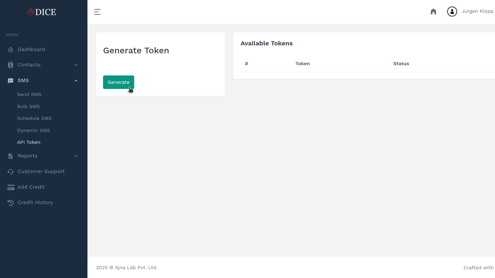
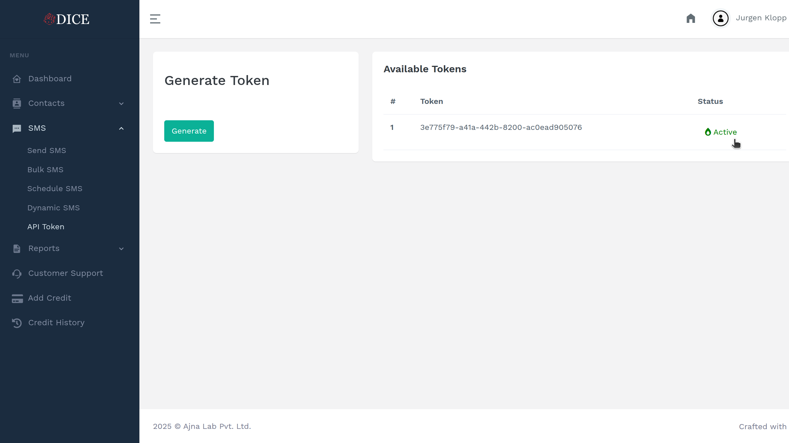

# Getting Started

This document serves as a guide on integrating DiceSMS Gateway in your application. Follow these steps to get started:

## Prerequisites

- Valid email address for account registration
- Basic understanding of REST APIs
- Development environment setup

## Account Setup

### Step 1: Sign Up on DiceSMS
Visit [DiceSMS Registration](https://dicesms.asia/) and create your account.

### Step 2: Choose SMS Package
Select an SMS package that fits your usage requirements from the available options.

### Step 3: Generate API Token
1. Navigate to [API Token Generation](https://dicesms.asia/api/token-generate/)

2. Generate your unique API token

3. **Important:** Store this token securely - it will be used for all API requests

### Step 4: Activate API Token
Complete the activation process to enable API access.

